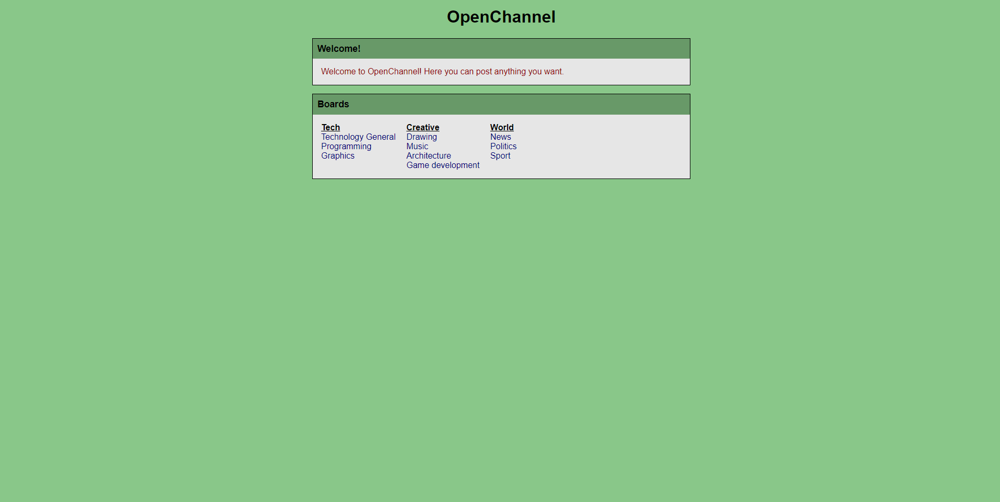
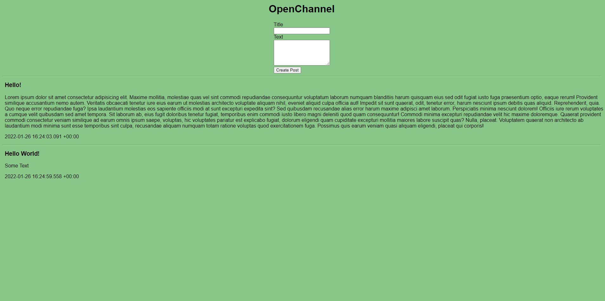

# Open Channel
This is simple web application that allows you to create posts on anonymous website for everyone to see. It was inspired by websites like 4chan.\
\
Back End: NodeJS, Express, SQLite, Sequelize\
Front End: JS, HTML, CSS

